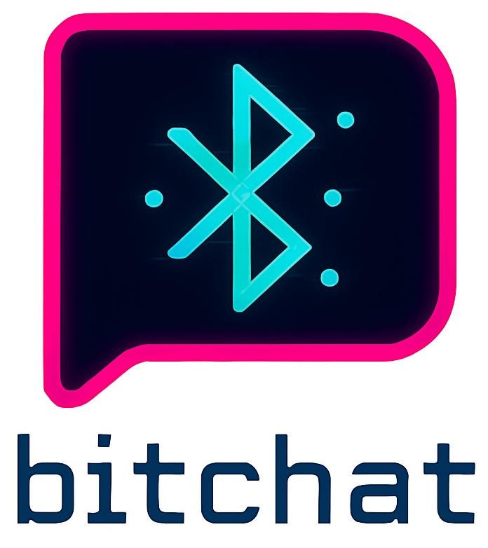

# Bitchat C++

  

A cross-platform Bluetooth mesh chat application written in C++ with platform abstraction. Bitchat enables peer-to-peer messaging over Bluetooth Low Energy (BLE) without requiring internet connectivity or centralized servers.

## 🚀 Quick Start

Bitchat is a cross-platform Bluetooth mesh chat application. Get started quickly with the [Usage Guide](extras/docs/usage.md) or dive into the [Development Guide](extras/docs/development.md) for building from source.

## 💬 How It Works

Bitchat creates a decentralized mesh network where devices communicate directly via Bluetooth Low Energy:

- **Mesh Networking** 🔗: Each device acts as both a sender and relay, forwarding messages to extend the network range
- **BLE Transport** 📡: Uses Bluetooth Low Energy for device discovery and data transmission
- **Cryptographic Security** 🔐: Ed25519 signatures ensure message authenticity and prevent tampering
- **Data Compression** 📦: LZ4 compression reduces bandwidth usage and improves transmission speed
- **Channel-based Communication** 💬: Users can join different channels for organized conversations

## 📖 Documentation

- **[🏗️ Architecture](extras/docs/architecture.md)** - How Bitchat works and project structure
- **[📡 Protocol Details](extras/docs/protocol.md)** - Technical protocol specifications
- **[💬 Usage Guide](extras/docs/usage.md)** - How to use the application
- **[🛠️ Development Guide](extras/docs/development.md)** - Building from source and contributing
- **[🔧 Troubleshooting](extras/docs/troubleshooting.md)** - Common issues and solutions

## 🔧 Key Features

- **Real-time Messaging** ⚡: Instant message delivery to nearby devices
- **Channel Support** 📢: Join different channels for organized conversations
- **Peer Discovery** 🔍: Automatically discover and connect to nearby devices
- **Signal Strength** 📶: Display RSSI values to gauge connection quality
- **Message History** 📝: View recent messages in the current session
- **Mesh Relay** 🔄: Messages are automatically relayed to extend network range
- **Security** 🔐: Ed25519 signatures for message authenticity
- **Compression** 📦: LZ4 compression for efficient data transmission

## 🤝 Contributing

We welcome contributions! Please see the [Development Guide](extras/docs/development.md) for details on:

- Setting up your development environment
- Code style guidelines
- Adding new platform support
- Testing and debugging

## 🔗 Original Projects

This C++ implementation is based on the original Bitchat projects:

- [Bitchat iOS](https://github.com/permissionlesstech/bitchat) - Original project
- [Bitchat Android](https://github.com/permissionlesstech/bitchat-android) - Android implementation

## 📄 License

This project is released into the public domain. See the [LICENSE](LICENSE) file for details.

