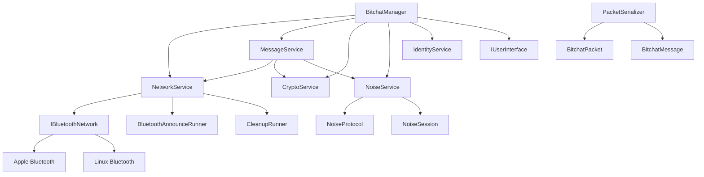

# Bitchat C++ Architecture

## Overview

Bitchat C++ follows a modular service-based architecture designed for maintainability, testability, and extensibility. The system is organized into distinct layers with clear separation of concerns, using a service-oriented approach for better modularity.

## Architecture Layers

### 1. Core Layer (`include/bitchat/core/`)

The core layer contains the main orchestrators and business logic:

#### BitchatManager
- **Purpose**: Main orchestrator that coordinates all components
- **Responsibilities**:
  - Initialize and manage all services
  - Provide high-level API for the application
  - Handle lifecycle management (start/stop)
  - Coordinate callbacks between components
- **Dependencies**: All services (NetworkService, MessageService, CryptoService, NoiseService)

#### BitchatData
- **Purpose**: Core data structures and constants
- **Responsibilities**:
  - Define application constants
  - Core data types
  - Configuration structures

### 2. Service Layer (`include/bitchat/services/`)

The service layer provides modular, focused functionality:

#### NetworkService
- **Purpose**: Manages network operations and peer discovery
- **Responsibilities**:
  - Bluetooth interface management
  - Peer discovery and tracking
  - Packet routing and relay
  - Network state management
- **Dependencies**: IBluetoothNetwork, BluetoothAnnounceRunner, CleanupRunner

#### MessageService
- **Purpose**: Handles chat messages and conversation state
- **Responsibilities**:
  - Message creation and processing
  - Channel management
  - Message history
  - Private messaging
- **Dependencies**: NetworkService, CryptoService, NoiseService

#### CryptoService
- **Purpose**: Cryptographic operations and key management
- **Responsibilities**:
  - Key pair generation/loading
  - Digital signatures (Ed25519)
  - Signature verification
  - Random number generation
- **Dependencies**: OpenSSL

#### NoiseService
- **Purpose**: Noise protocol implementation for secure communication
- **Responsibilities**:
  - Session management
  - Handshake protocol
  - Encryption/decryption
  - Key exchange
- **Dependencies**: Noise protocol library

#### IdentityService
- **Purpose**: Identity and authentication management
- **Responsibilities**:
  - User identity management
  - Authentication state
  - Identity verification
- **Dependencies**: CryptoService

### 3. Platform Layer (`include/bitchat/platform/`)

Platform-specific implementations and abstractions:

#### IBluetoothNetwork
- **Purpose**: Abstract interface for Bluetooth operations
- **Responsibilities**:
  - Device discovery
  - Connection management
  - Data transmission
  - Platform abstraction

#### BluetoothFactory
- **Purpose**: Factory for creating platform-specific Bluetooth implementations
- **Responsibilities**:
  - Platform detection
  - Interface instantiation

### 4. Protocol Layer (`include/bitchat/protocol/`)

Protocol definitions and serialization:

#### Packet Classes
- **BitchatPacket**: Core packet structure
- **BitchatMessage**: Chat message structure
- **PacketSerializer**: Serialization utilities

#### Message Padding
- **Purpose**: Message padding for security
- **Responsibilities**:
  - Add/remove padding
  - Padding validation

### 5. Noise Protocol Layer (`include/bitchat/noise/`)

Advanced cryptographic protocol implementation:

#### NoiseProtocol
- **Purpose**: Noise protocol implementation
- **Responsibilities**:
  - Protocol state management
  - Handshake patterns
  - Key exchange

#### NoiseSession
- **Purpose**: Session management for Noise protocol
- **Responsibilities**:
  - Session state
  - Encryption/decryption
  - Session lifecycle

#### NoiseRole
- **Purpose**: Define roles in Noise protocol
- **Responsibilities**:
  - Initiator/responder roles
  - Role resolution

### 6. UI Layer (`include/bitchat/ui/`)

User interface abstractions:

#### IUserInterface
- **Purpose**: Abstract interface for UI implementations
- **Responsibilities**:
  - Message display
  - User input handling
  - Status updates
  - Event callbacks

#### ConsoleUI
- **Purpose**: Console-based user interface
- **Responsibilities**:
  - Terminal-based interaction
  - Command parsing
  - Text-based display

#### DummyUI
- **Purpose**: Testing and headless operation
- **Responsibilities**:
  - Minimal UI for testing
  - Automated operation

### 7. Runners Layer (`include/bitchat/runners/`)

Background task management:

#### BluetoothAnnounceRunner
- **Purpose**: Periodic peer announcements
- **Responsibilities**:
  - Broadcast presence
  - Keep-alive messages
  - Network discovery

#### CleanupRunner
- **Purpose**: Cleanup stale connections and data
- **Responsibilities**:
  - Remove stale peers
  - Cleanup expired sessions
  - Memory management

### 8. Helpers Layer (`include/bitchat/helpers/`)

Utility functions and helpers:

#### CompressionHelper
- **Purpose**: Data compression utilities
- **Responsibilities**:
  - LZ4 compression/decompression
  - Compression decision logic

#### DateTimeHelper
- **Purpose**: Date and time utilities
- **Responsibilities**:
  - Timestamp handling
  - Time formatting

#### NoiseHelper
- **Purpose**: Noise protocol utilities
- **Responsibilities**:
  - Protocol helpers
  - Key management utilities

#### ProtocolHelper
- **Purpose**: Protocol utilities
- **Responsibilities**:
  - Packet validation
  - Protocol compliance

#### StringHelper
- **Purpose**: String manipulation utilities
- **Responsibilities**:
  - String formatting
  - Text processing

## Component Relationships

## Data Flow

### Message Sending
1. **BitchatManager** receives send request
2. **MessageService** creates message and packet
3. **CryptoService** signs the packet
4. **NoiseService** encrypts the payload
5. **CompressionHelper** compresses if beneficial
6. **NetworkService** sends via Bluetooth
7. **IBluetoothNetwork** transmits to peers

### Message Receiving
1. **IBluetoothNetwork** receives packet
2. **NetworkService** processes and routes packet
3. **MessageService** parses and validates message
4. **CryptoService** verifies signature
5. **NoiseService** decrypts the payload
6. **CompressionHelper** decompresses if needed
7. **BitchatManager** notifies UI via callback

## Threading Model

### NetworkService Threads
- **Main Thread**: API calls and state management
- **Announce Thread**: Periodic peer announcements (BluetoothAnnounceRunner)
- **Cleanup Thread**: Stale peer removal (CleanupRunner)

### MessageService Threads
- **Main Thread**: Message processing and history management
- **Background**: Async operations (if needed)

### IBluetoothNetwork Threads
- **Platform-specific**: Bluetooth event handling
- **Main Thread**: API calls and state management

## Error Handling

### Exception Safety
- All public methods are exception-safe
- RAII for resource management
- Graceful degradation on errors

### Error Propagation
- Return codes for recoverable errors
- Exceptions for unrecoverable errors
- Logging at appropriate levels

## Configuration

### Build-time Configuration
- Platform detection (Apple/Linux/Windows)
- Feature flags
- Compiler-specific optimizations

### Runtime Configuration
- Bluetooth settings
- Crypto parameters
- Compression thresholds

## Testing Strategy

### Unit Testing
- Each service can be tested independently
- Mock interfaces for dependencies
- Protocol compliance testing

### Integration Testing
- End-to-end message flow
- Cross-platform compatibility
- Performance benchmarks

## Future Extensions

### Planned Features
- Message encryption (implemented via Noise protocol)
- File sharing
- Voice messages
- Group channels

### Architecture Benefits
- Easy to add new features
- Platform independence
- Testable components
- Clear separation of concerns
- Service-oriented design

## Performance Considerations

### Memory Management
- RAII for automatic cleanup
- Smart pointers for ownership
- Efficient data structures

### Network Optimization
- Compression for large messages
- Connection pooling
- Bandwidth monitoring

### Thread Safety
- Lock-free operations where possible
- Minimal critical sections
- Async operations for I/O
